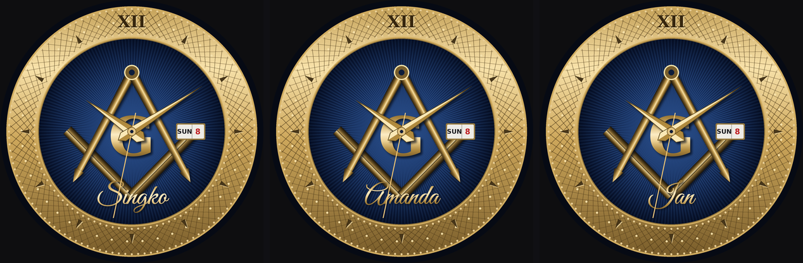

# Square and Compasses — Garmin watch face

A navy engine-turned dial with a guilloche gold chapter ring, an applied square
and compasses around an ornate G, a day/date aperture at three, and your name
engraved in script below the emblem. Built for the Epix Gen 2 (416 × 416 AMOLED)
and the Epix Pro sizes.



## The name on the dial

`OwnerName` is a watch setting — it defaults to **Singko**. About twelve
characters fit before the script starts crowding the square.

Connect IQ has no cursive system font, so the name is drawn from a custom bitmap
font baked out of [Great Vibes](https://fonts.google.com/specimen/Great+Vibes)
(SIL OFL 1.1; the licence travels with the font in `assets/`). Regenerate it
with `python3 bake_font.py`.

To preview a name without building anything:

```bash
python3 render_v3.py Amanda      # writes out/v3_full.png
```

## How it's put together

The dial is expensive to draw and only changes when the settings do, so it's
rendered once into a `BufferedBitmap` and blitted each second. Only the hands
and the day/date text are drawn per frame.

- `source/DialRenderer.mc` — the static layer: rayed blue centre, gold band with
  its engine-turned lattice and beading, engraved numerals and darts, the
  aperture frame, the emblem.
- `source/GaugeFaceView.mc` — the live layer, the engraved name, and a separate
  always-on drawing.
- `resources/drawables/emblem.png` — the square, compasses and G, baked with
  real gradients because Monkey C primitives can't produce them.
- `resources/fonts/` — the script atlas.
- `render_v3.py`, `bake_emblem.py`, `bake_font.py` — the Python renderers used
  to design the dial and produce the assets.

Always-on is a separate, much darker drawing — thin gold on black, no second
hand, no name, shifted a few pixels each minute. A lit blue dial can't pass the
always-on budget, so the two states deliberately look different.

`render_v2.py` is an earlier "Twenty-Four Inch Gauge" design that this one
replaced. It stays because the current renderers still import its shared
gold-and-geometry helpers.

## Installing on your Epix Gen 2

**1. Install the tools.** Download the Connect IQ SDK Manager from
developer.garmin.com, install a current SDK, and in the Devices tab install the
`epix2` device definition. Then add the Monkey C extension to VS Code.

**2. Make a developer key** (once, ever):

```bash
openssl genrsa -out developer_key.pem 4096
openssl pkcs8 -topk8 -inform PEM -outform DER \
  -in developer_key.pem -out developer_key.der -nocrypt
```

**3. Build.** In VS Code: Ctrl+Shift+P → *Monkey C: Build for Device* → pick
epix2. Or from a terminal:

```bash
monkeyc -f monkey.jungle -o GaugeFace.prg -y developer_key.der -d epix2 -r
```

Try it first in the simulator with *Monkey C: Run App* — and while it's running,
use the simulator's burn-in test, which simulates 24 hours and reports whether
the always-on state would cause burn-in.

**4. Copy it to the watch.** Plug the Epix in with the charging cable; it mounts
as a USB drive. Copy `GaugeFace.prg` into `GARMIN/APPS/`, eject properly, unplug.

**5. Select it.** Hold MENU from any watch face → Watch Face → scroll to it →
Apply. If it doesn't appear, restart the watch.

**6. Settings.** Sideloaded apps don't show settings in the Garmin Connect phone
app — use the Connect IQ desktop simulator, or upload the app as a private app
if you want to set the name from your phone.

## Things to expect on first build

I couldn't compile this — no Garmin SDK in the environment it was written in.
Budget an hour for the usual friction:

- **The custom font is the least certain part.** Its metrics are verified
  against a direct render, but nothing has confirmed Garmin's resource compiler
  accepts this BMFont dialect or wants an RGBA atlas. If it's rejected, the name
  falls back to a system font and stops being cursive.
- **Device IDs.** Check the folder names under `~/.Garmin/ConnectIQ/Devices/`
  and reconcile `manifest.xml` against them.
- **Memory.** If the full-screen buffer fails to allocate, halve `RAYS` in
  `DialRenderer.mc`, or render the buffer at half resolution and scale on blit.
- **Startup cost.** The static layer is roughly 900 primitive calls, once, in
  `onLayout`. `RAYS` and `LATTICE` are the levers if the face is slow to appear.

## On the artwork

The emblem is a generic square and compasses built from scratch. Grand Lodge
seals and lodge crests are protected marks — if you want one, supply the asset
and add it as another bitmap drawable.
