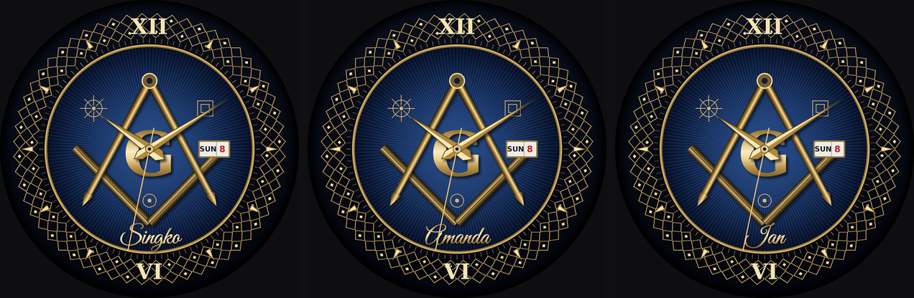

# Masonic Dials — Garmin watch face

Two dials in one watch face, chosen in the settings. Built for the Epix Gen 2
(416 × 416 AMOLED) and the Epix Pro sizes.


**Square and Compasses** (default) — a navy engine-turned centre inside a
near-black band carrying a gold quilted lattice, gold XII and VI, fine gold line-work
in the blue field (blazing star, small square, point within a circle), the
applied square and compasses around an ornate G, a day/date aperture at three,
and your name engraved in script below the emblem.

**Twenty-Four Inch Gauge** — the outer ring is a rule marked to eighths across a
24-hour rotation, divided into three arcs of eight for refreshment, labour and
service, with sunrise and sunset marked and the night hours shaded. The hands
read normal 12-hour time; the brass cursor on the rim shows position in the
24-hour day. Two subdials and a top window.

## The name on the dial



`OwnerName` is a watch setting — it defaults to **Singko**, and applies to the
Square and Compasses dial. About twelve characters fit before the script starts
crowding the square.

Connect IQ has no cursive system font, so the name is drawn from a custom bitmap
font baked out of [Great Vibes](https://fonts.google.com/specimen/Great+Vibes)
(SIL OFL 1.1; the licence travels with the font in `assets/`). Regenerate it
with `python3 bake_font.py`.

To preview a name without building anything:

```bash
python3 render_v3.py Amanda      # writes out/v3_full.png
```

## Settings

| setting | dial | options |
| --- | --- | --- |
| Dial | both | Square and Compasses, Twenty-Four Inch Gauge |
| Name on the dial | Square | up to 16 characters |
| Second hand | both | on / off |
| Left subdial, Right subdial | Gauge | battery, steps, body battery |
| Top window | Gauge | heart rate, altitude, empty |

Connect IQ can't hide settings conditionally, so the dial-specific ones stay
visible on both and say which dial they affect.

## How it's put together

Each dial is expensive to draw and only changes when the settings do, so the
active one is rendered once into a `BufferedBitmap` and blitted each second.
Only the hands, the complications and the date text are drawn per frame.

- `source/DialSquare.mc` — the Square dial's static layer.
- `source/DialGauge.mc` — the Gauge dial's static layer.
- `source/GaugeFaceView.mc` — holds the style and dispatches the static build,
  the live layer and the always-on drawing.
- `resources/drawables/emblem_square.png`, `emblem_gauge.png` — the applied
  emblems, baked with real gradients because Monkey C primitives can't produce
  them. Separate assets: the Gauge emblem has heavier limbs and no G, since that
  dial draws its own.
- `resources/fonts/` — the script atlas for the name.
- `render_v3.py` (Square), `render_v2.py` (Gauge), `bake_emblem.py`,
  `bake_font.py` — the Python renderers used to design the dials and produce the
  assets.

Always-on is a separate, much darker drawing — thin gold on black, no second
hand, no name, shifted a few pixels each minute. A lit dial can't pass the
always-on budget, so the two states deliberately look different.

## Installing on your Epix Gen 2

**1. Install the tools.** Download the Connect IQ SDK Manager from
developer.garmin.com, install a current SDK, and in the Devices tab install the
`epix2` device definition. Then add the Monkey C extension to VS Code.

**2. Make a developer key** (once, ever):

```bash
openssl genrsa -out developer_key.pem 4096
openssl pkcs8 -topk8 -inform PEM -outform DER \
  -in developer_key.pem -out developer_key.der -nocrypt
```

**3. Build.** In VS Code: Ctrl+Shift+P → *Monkey C: Build for Device* → pick
epix2. Or from a terminal:

```bash
monkeyc -f monkey.jungle -o GaugeFace.prg -y developer_key.der -d epix2 -r
```

Try it first in the simulator with *Monkey C: Run App* — and while it's running,
use the simulator's burn-in test, which simulates 24 hours and reports whether
the always-on state would cause burn-in.

**4. Copy it to the watch.** Plug the Epix in with the charging cable; it mounts
as a USB drive. Copy `GaugeFace.prg` into `GARMIN/APPS/`, eject properly, unplug.

**5. Select it.** Hold MENU from any watch face → Watch Face → scroll to it →
Apply. If it doesn't appear, restart the watch.

**6. Settings.** Sideloaded apps don't show settings in the Garmin Connect phone
app — use the Connect IQ desktop simulator, or upload the app as a private app
if you want to switch dials or set the name from your phone.

## Things to expect on first build

It compiles and runs on a real Epix Gen 2, custom font and all. But the SDK
isn't available in the environment it's developed in, so a fresh checkout is
worth treating with care:

- **The custom font is known to work on device.** If you ever swap the typeface
  and the resource compiler rejects the new atlas, `drawName` falls back to a
  system font and the name simply stops being cursive.
- **Device IDs.** Check the folder names under `~/.Garmin/ConnectIQ/Devices/`
  and reconcile `manifest.xml` against them.
- **Memory and startup.** Two dials means two static layers of code and two
  emblem assets, though only one of each is live at a time. The Square dial's
  static layer is about 875 primitive calls, drawn once in `onLayout`; if it's
  slow to appear, drop `LATTICE_R` to 2 in `DialSquare.mc`. If the full-screen
  buffer fails to allocate, render it at half resolution and scale on blit.
- **Sunrise and sunset** (Gauge dial) need a position fix; until the watch has
  one they fall back to 05:45 and 18:15.
- **Body battery** is guarded with a `has` check and will read zero where it
  isn't exposed.

## On the artwork

The emblems are generic squares and compasses built from scratch. Grand Lodge
seals and lodge crests are protected marks — if you want one, supply the asset
and add it as another bitmap drawable.
